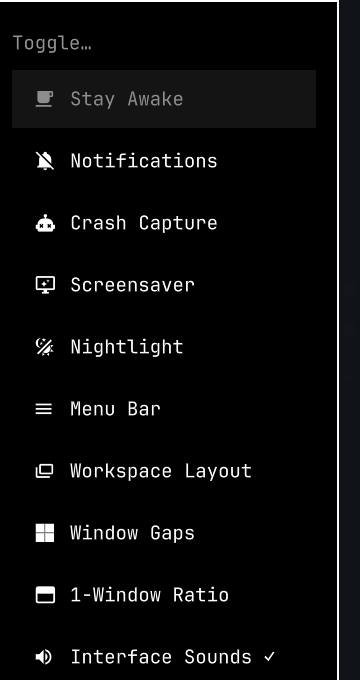

# Omarchy interface sounds

Theme-aware window and workspace clicks for [Omarchy](https://omarchy.org/).


This is an Omarchy **shell plugin**, not a theme and not a standalone daemon. That is the distribution channel Omarchy already has: a git repo with a `manifest.json`, installed by `omarchy plugin add`.

```bash
omarchy plugin add https://github.com/gobijan/omarchy-ui-sounds.git --enable
```

Update and remove are the same channel:

```bash
omarchy plugin update gobijan.ui-sounds
omarchy plugin remove gobijan.ui-sounds
```

The plugin is a headless `service`. Enabling it is enough — it does not add a bar widget. It listens to Hyprland events inside `omarchy-shell` and plays short `SoundEffect`s, so there is no extra systemd unit.

## Why a plugin, not a theme

| Channel | What it installs | Why not this |
|---|---|---|
| `omarchy theme install` | colors, backgrounds, app tints | Themes do not run code |
| `omarchy plugin add` | QML that lives in the shell | **This.** Events + playback belong here |
| AUR / `install.sh` | extra daemons and units | Works, but duplicates what the shell already hosts |

Themes *can* still ship the samples. The plugin is what plays them.

## Theme sound packs

Drop files named after the event into a theme. `omarchy theme install` already clones a theme repo into `~/.config/omarchy/themes/<slug>/`, so a theme author only needs this extra directory:

```text
your-theme/
  colors.toml
  backgrounds/
  sounds/
    openwindow.wav
    closewindow.wav
    workspace.wav
    fullscreen.wav
    unfullscreen.wav
    float.wav
    unfloat.wav
    minimize.wav
    urgent.wav
    bell.wav
```

Lookup order:

1. `~/.config/omarchy/themes/<theme>/sounds/`
2. the active theme's staged copy
3. a named pack (`pack=quake` → `packs/quake/` in the plugin, or `~/.config/omarchy/sounds/packs/quake/`)
4. a generated pack tinted from that theme's `colors.toml`
5. `~/.config/omarchy/sounds/default/`

Formats: `wav`, `ogg`, `oga`, `mp3`, `flac`, `opus`. Generated clicks are 44.1 kHz mono WAV.

If a theme has no `sounds/` directory, the plugin synthesizes a pack from the theme accent so switching themes still changes the clicks.

## Config

`~/.config/omarchy/sounds/config` is created on first run:

```ini
enabled=true
volume=0.38
startup_grace_ms=1500
burst_ms=140
pack=quake
# event.urgent=false
```

`pack=quake` is a shipped 90s-FPS homage (original synthesis, not ripped game files). Clear it or set `pack=theme` to follow the Omarchy theme palette instead.

## Control

Super menu → **Trigger → Toggle → Interface Sounds**:



```bash
omarchy-shell ui-sounds status
omarchy-shell ui-sounds toggle
omarchy-shell ui-sounds play openwindow
omarchy-shell ui-sounds pack quake
omarchy-shell ui-sounds pack theme
omarchy-shell ui-sounds generate
```

## Local development

```bash
omarchy plugin add /path/to/omarchy-ui-sounds --enable --yes
omarchy plugin validate /path/to/omarchy-ui-sounds
```

`omarchy plugin add` clones the repo into `~/.config/omarchy/plugins/gobijan.ui-sounds/`. After that, edit the checkout there or update from the origin.

## Requirements

Omarchy with `omarchy-shell` (Quickshell) and `qt6-multimedia`. Both ship with current Omarchy.

## License

MIT. See [LICENSE](LICENSE).
